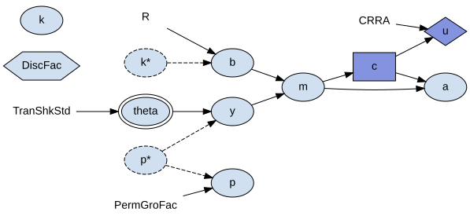
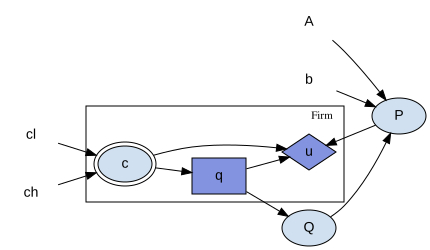
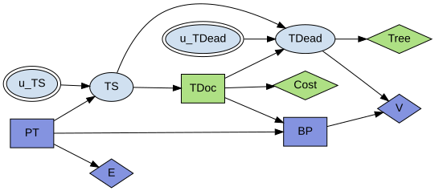

# Reading Model Diagrams

A block can draw itself as a diagram: nodes for its shocks, states, controls,
rewards, and parameters, and edges for the structural equations that connect
them. This page is a legend for that diagram. It explains what each shape,
color, and box means, names the graphical conventions the notation borrows, and
points to where the drawing style is configured. It does not walk through the
visualizer's code; for that, see {doc}`../api/analysis`.

## Producing a Diagram

The usual way to see a diagram is from a notebook:

```python
block.display(calibration)
```

`Block.visualize(calibration, title=None, discount=None)` returns the visualizer
object instead of displaying it, which is useful when you want to inspect or
further customize it. `title` defaults to the block's name; pass `title=""` if
you are supplying your own caption.

To render onto a matplotlib figure -- for a script, or a documentation gallery
-- use
`skagent.utils.plot_block_diagram(block, title=None, calibration=None, figsize=(9, 7), discount=None)`.

The `calibration` argument is what tells the diagram which symbols are
calibration parameters rather than dynamic variables, so it decides which shapes
are drawn. `display` and `visualize` require it; `plot_block_diagram` treats it
as empty when it is left out.

If the block's problem has a discount factor, pass its calibration symbol as
`discount=`, so it is drawn as a hexagon rather than as an ordinary parameter. A
block cannot work this out on its own -- the discount variable is a choice made
by the period built over the block, not a fact recorded on the block itself --
so it has to be supplied. When you already have a `BellmanPeriod`, its
`discount_variable` attribute is the value to pass.

## The Shape Vocabulary

Every node in the diagram is one of six kinds, distinguished by shape:

| Kind                   | Shape                         | Notes                                         |
| ---------------------- | ----------------------------- | --------------------------------------------- |
| Shock                  | ellipse, double border        | drawn with two peripheries                    |
| State / computed value | ellipse                       | the default shape                             |
| Control                | box                           |                                               |
| Reward                 | diamond                       |                                               |
| Discount factor        | hexagon                       | reserved for the one discount-factor variable |
| Calibration parameter  | name only, no border, no fill | `plaintext`                                   |

Edges run from a variable's inputs to the variable itself, so an edge is a
causal dependency read directly off the block's structural equations.



Above, a consumption-saving block with every shape in it: `theta` is the shock,
`c` the control, `u` the reward, `DiscFac` the discount factor, the bare names
are calibration parameters, and the rest are computed values.

## Color, Dashing, and Layout

Nodes are filled with a color per agent, so a multi-agent model shows at a
glance which agent's role owns which control and reward. The colors are
generated by a sweep over hue rather than assigned by hand, so the same agent
always gets the same color across a run but the color itself carries no meaning
beyond "same agent" -- do not read anything into which agent got which hue.

A node whose name ends in `*`, drawn with a dashed outline, is an arrival value:
the variable as it stood at the end of the previous period, entering this one as
a lag. Edges leaving such a node are dashed too, and its tooltip is prefixed
"Previous period ". A symbol the block reads but never assigns appears twice for
this reason -- once as the dashed `*` node its equations read, and once as a
bare node for the current period, which this block does not assign. See
{doc}`blocks` for what an arrival state is in the block model itself.

The graph lays out left to right, so causal flow within a period reads in the
same direction as the equations that produced it.

## Entity Classes as Plates

When a block's variables belong to an entity class, the diagram draws a labelled
box around them, one box per class, holding the class's own variables and their
edges. An edge that leaves the box is an aggregation -- some axis-free equation
reading out of the class, the kind of crossing described in {doc}`blocks`.



Above, a Cournot market: the `Firm` box holds the variables each firm has its
own copy of, and the edge from `q` to `Q` leaves the box, which is the
aggregation over the class. `P` is outside the box because there is one price,
not one per firm, and it feeds back into every firm's `u`.

The box's label is the class's name only. It deliberately does not carry the
class's size. The diagram carries no other number from the calibration either,
and putting one on this box alone would suggest the picture had been drawn for
one particular calibration rather than for the model in general.

## What Is Not Drawn

A calibration parameter that no equation in the block actually reads is left off
the diagram. Such a parameter is usually an artifact of a calibration dictionary
written for a whole family of blocks, where using one block still carries along
parameters meant for the others; drawing it would add a node connected to
nothing, which is not a fact about this block.

Nothing else is dropped this way. An unread shock, state, control, or reward is
not treated as an artifact -- it is a defect in the model, and the diagram is
exactly where it should be visible. Likewise, a variable named as the discount
factor is always kept, even if no equation reads it, since it is still part of
the problem being solved.

## Precedent

The notation is not new. Two conventions are borrowed directly, and knowing
where each one comes from tells you what you are allowed to read off the
picture.

### Multi-agent influence diagrams

The shape vocabulary -- decision, chance, and utility nodes drawn differently,
connected by directed edges for causal dependence, with each agent's nodes in
their own color -- is the multi-agent influence diagram of Koller and Milch,
"Multi-Agent Influence Diagrams for Representing and Solving Games" (IJCAI-01;
Games and Economic Behavior 45(1), 2003). That is where the notation comes from,
and `skagent.models.macid` encodes several of the games from that literature
directly, the tree-killer example among them.

This is more than a borrowed drawing style: a block, read structurally, already
has the form these diagrams describe, which is why the picture is faithful
rather than illustrative. `skagent.influence` builds that structural reading --
a structural causal influence model, after Everitt, Carey, Langlois, Ortega and
Legg, "Agent Incentives: A Causal Perspective" (AAAI-21; arXiv:2102.01685),
which is an influence diagram whose mechanisms are functions of their parents
rather than conditional probability tables. A block's dynamics are already
written that way.



Above, the tree-killer game. Each agent's nodes carry their own color, so the
two decision boxes belonging to one agent are distinguishable at a glance from
the other's, and each diamond is owned by whoever it pays.

### Plate notation, for entity classes

The box drawn around an entity class is plate notation, the same device used in
graphical-model tools such as PyMC and Pyro. A plate is a template: its meaning
is the "ground" graph it expands to, one copy of every variable inside it per
instance of the class, with an aggregating variable outside the plate taking all
of those copies as parents. The compact box-and-edges drawing is that ground
graph collapsed by exchangeability among the copies.

scikit-agent calls these groupings entity classes rather than plates; it is the
drawing convention, not the name, that is borrowed.

## Configuring the Style

The shapes, colors, and layout described above are not hard-coded. They live in
`src/skagent/model_visualization_config.yaml`, shipped with the package. That
file holds the shape assigned to each variable kind, the node and edge styles
(including the double border on shocks and the dashed style for arrival values),
the parameters of the color-generation sweep, and the layout settings such as
left-to-right ranking and the plate label's font size. To change how diagrams
are drawn by default, edit that file.

## Seeing It Rendered

The figures above are small models chosen to show one thing each. For diagrams
of models being put to work, with the surrounding analysis, see the gallery:

- {doc}`../auto_examples/models/plot_cournot_equilibrium` shows an entity class
  drawn as a plate, with an edge leaving it for the aggregation.
- {doc}`../auto_examples/models/plot_tree_killer_relevance` shows a multi-agent
  influence diagram with two agents.
- {doc}`../auto_examples/models/plot_lemons_adverse_selection` shows a larger
  model that includes an entity class.

For the class and function reference behind the diagram, see
{doc}`../api/analysis`.
